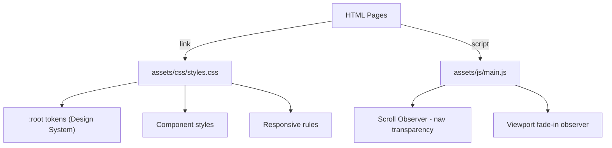

# Design Document: Website Redesign V2

## Overview

This design describes the technical implementation for transforming the Built By Veterans website from its current blue-centric color palette to a premium dark/graphite/deep-red enterprise aesthetic. The site is a static HTML/CSS/JS project served as individual pages (index.html, about.html, services.html, etc.) with a single shared stylesheet (`assets/css/styles.css`) and a minimal JavaScript file (`assets/js/main.js`).

The redesign is a visual-only transformation. No page URLs, semantic HTML structure, heading hierarchy, meta tags, or JavaScript functionality will change. The implementation replaces CSS custom properties, updates component styles, and adds a small amount of JavaScript for scroll-based navigation behavior.

### Design Decisions

| Decision | Choice | Rationale |
|----------|--------|-----------|
| Implementation scope | CSS-first, minimal HTML changes | Preserves SEO, content, and structure; minimizes regression risk |
| Token approach | CSS custom properties in `:root` | Already used in current stylesheet; broadens to full design system |
| Navigation scroll behavior | Intersection Observer API | Performant, non-blocking, no external dependency |
| Industries section conversion | Replace card markup with icon row | Requirement 7 mandates layout change; controlled HTML edit |
| Animation system | CSS `@keyframes` + utility classes | No library needed; keeps bundle at zero JS dependencies |
| Metallic gradient | `background-clip: text` with linear gradient | Well-supported (all modern browsers), pure CSS |
| Glass effect | `backdrop-filter: blur` + semi-transparent bg | Modern CSS, progressive enhancement |

---

## Architecture

The architecture remains a flat static site with no build step. The redesign modifies three layers:



### Change Boundaries

1. **CSS (`styles.css`)** — Primary change target. Tokens are redefined, component selectors are updated, new utility classes are added.
2. **HTML (all pages)** — Minimal targeted edits:
   - Homepage industries section: replace large cards with icon row markup.
   - Navigation: add `data-nav-transparent` attribute for scroll behavior.
   - Images below fold: add `loading="lazy"` where missing.
3. **JS (`main.js`)** — Add Intersection Observer for nav scroll state and viewport fade-in.

---

## Components and Interfaces

### 1. Design System Tokens (CSS Custom Properties)

All tokens live in `:root` within `styles.css`.

```css
:root {
  /* Color tokens */
  --bg-primary: #050505;
  --bg-secondary: #101114;
  --bg-panel: #16181D;
  --border: #2C3138;
  --brand: #B70E18;
  --brand-hover: #D91F2F;
  --metallic: #B7BDC7;
  --white: #FFFFFF;
  --success: #22C55E;
  --text-primary: #FFFFFF;
  --text-muted: #B7BDC7;

  /* Typography tokens */
  --font-family: 'Inter', ui-sans-serif, system-ui, -apple-system, sans-serif;
  --font-size-hero: clamp(50px, 6.2vw, 78px);
  --font-size-h2: clamp(32px, 4vw, 48px);
  --font-size-h3: 20px;
  --font-size-body: 16px;
  --font-size-small: 14px;
  --font-size-eyebrow: 13px;
  --font-weight-bold: 800;
  --font-weight-medium: 600;
  --line-height-tight: 0.96;
  --line-height-normal: 1.65;
  --letter-spacing-tight: -0.06em;

  /* Spacing tokens */
  --space-xs: 8px;
  --space-sm: 16px;
  --space-md: 24px;
  --space-lg: 48px;
  --space-xl: 80px;
  --radius-sm: 9px;
  --radius-md: 16px;
  --radius-lg: 22px;

  /* Shadow tokens */
  --shadow-card: 0 18px 55px rgba(0, 0, 0, 0.25);
  --shadow-btn: 0 12px 30px rgba(183, 14, 24, 0.28);
  --shadow-panel: 0 24px 80px rgba(0, 0, 0, 0.35);

  /* Transition tokens */
  --transition-fast: 150ms ease;
  --transition-base: 250ms ease;
  --transition-slow: 400ms ease;
}
```

### 2. Navigation Bar Component

**Behavior**: Transparent overlay on hero → sticky solid dark on scroll.

```
┌─────────────────────────────────────────────────────────┐
│ [Logo]  Services  Industries  About Us  Resources  [CTA]│
└─────────────────────────────────────────────────────────┘
```

- **Default state** (hero visible): `background: transparent; border-bottom: 1px solid rgba(255,255,255,0.08)`
- **Scrolled state** (`.nav-scrolled`): `background: var(--bg-primary); backdrop-filter: blur(18px); border-bottom: 1px solid var(--border)`
- **Trigger**: Intersection Observer watches `.hero` element; when hero leaves viewport, adds `.nav-scrolled` class to `<header>`.
- **CTA button**: Styled as Primary_CTA (red background, white text).

### 3. Hero Section

```
┌───────────────────────────────────────────────────────────┐
│  [Left Column]              │  [Right Column]             │
│  Eyebrow text (red)         │  Dashboard Component        │
│  H1 (metallic gradient)     │  (glass container)          │
│  Body text (muted)          │                             │
│  [Primary CTA] [Secondary]  │                             │
│  Trust Indicators strip     │                             │
└───────────────────────────────────────────────────────────┘
```

- **Background**: `radial-gradient(circle at 70% 20%, rgba(183,14,24,0.12), transparent 40%), linear-gradient(135deg, #050505, #101114)`
- **Texture**: Faint grid overlay using repeating `linear-gradient` lines at very low opacity (~0.02).
- **Metallic headline**: `background: linear-gradient(135deg, #B7BDC7, #FFFFFF, #B7BDC7); -webkit-background-clip: text; color: transparent;`

### 4. Dashboard Component

Retains the existing HTML structure (ops-shell, ops-rail, ops-main, ops-stats, ops-table). Color changes only:

| Current | New |
|---------|-----|
| `#3b82f6` / `var(--blue)` sparklines | `var(--brand)` (#B70E18) or `var(--metallic)` |
| `rgba(47,108,255,...)` glows | `rgba(183,14,24,...)` red tones |
| `#79a4ff` active nav | `var(--brand)` |
| Green indicators | Unchanged (`var(--success)`) |

Glass effect on container: `background: rgba(22,24,29,0.7); backdrop-filter: blur(12px); border: 1px solid rgba(255,255,255,0.1);`

### 5. Button Components

| Variant | Background | Border | Text | Hover |
|---------|-----------|--------|------|-------|
| Primary | `var(--brand)` | `var(--brand)` | `#fff` | `box-shadow: 0 0 24px rgba(183,14,24,0.4); transform: translateY(-2px)` |
| Secondary | `rgba(255,255,255,0.04)` | `1px solid rgba(255,255,255,0.18)` | `#fff` | `transform: translateY(-2px); border-color: rgba(255,255,255,0.35)` |

### 6. Service Cards

- Background: `var(--bg-panel)` with subtle gradient overlay
- Border: `1px solid var(--border)`
- Icon: Silver/gray (`var(--metallic)`) default
- Hover: `transform: translateY(-4px); border-color: rgba(183,14,24,0.4); box-shadow: 0 0 20px rgba(183,14,24,0.15);` Icon transitions to `var(--brand)`.

### 7. Industry Icon Row (Homepage)

Replaces the current `.industry-grid` of large image cards with a compact icon row:

```html
<div class="industry-icon-row">
  <a href="industries.html#dental" class="industry-link">
    
    <span>Dental Practices</span>
  </a>
  <!-- repeat for each industry -->
</div>
```

CSS: Flexbox row, centered, gap 48px. Icons `width: 48px`, grayscale/silver default, red on hover. Stacks vertically at ≤900px.

### 8. Trust Logo Bar

- Container background: `var(--bg-primary)` or `var(--bg-secondary)`
- Logos: `filter: grayscale(1) brightness(2); opacity: 0.55;`
- Hover: `opacity: 1; filter: grayscale(0);` with `transition: var(--transition-base)`

### 9. Animation Utilities

```css
.fade-in {
  opacity: 0;
  transform: translateY(16px);
  transition: opacity var(--transition-slow), transform var(--transition-slow);
}
.fade-in.visible {
  opacity: 1;
  transform: translateY(0);
}
```

Intersection Observer in `main.js` adds `.visible` class when elements enter viewport.

**Constraints**: Only fade, lift (translateY), glow (box-shadow), and scale transforms. Duration range: 150ms–400ms. No spin, bounce, parallax, or flashy effects.

---

## Data Models

This project has no application data model (no database, no API). The only "data" is static HTML content and CSS tokens.

**Design Token Schema** (conceptual):

| Token Category | Examples | Format |
|---|---|---|
| Colors | `--bg-primary`, `--brand`, `--success` | Hex (#RRGGBB) or rgba() |
| Typography | `--font-size-hero`, `--font-weight-bold` | px/clamp/numeric |
| Spacing | `--space-md`, `--radius-lg` | px |
| Shadows | `--shadow-card`, `--shadow-btn` | CSS box-shadow value |
| Transitions | `--transition-base` | duration + easing |

---

## Correctness Properties

*A property is a characteristic or behavior that should hold true across all valid executions of a system — essentially, a formal statement about what the system should do. Properties serve as the bridge between human-readable specifications and machine-verifiable correctness guarantees.*

> **Note:** This is a static HTML/CSS/JS website redesign. Traditional property-based testing with randomized inputs does not apply (there are no pure functions or data transformations). However, the following properties are universally quantified assertions that can be verified programmatically across all pages and elements in the site.

### Property 1: No residual blue colors

*For any* CSS declaration in `styles.css` and *for any* computed color value (color, background-color, border-color, fill, stroke) on any element across all pages, the value SHALL NOT contain any shade of the old blue palette (#2f6cff, #78a6ff, #3b82f6, or rgba(47,108,255,...) variants).

**Validates: Requirements 1.6, 4.3, 6.3**

### Property 2: Animation type and duration constraints

*For any* CSS `@keyframes` rule, `transition`, or `animation` declaration in the stylesheet, (a) only opacity, transform(translateY), transform(scale), and box-shadow properties SHALL be animated, and (b) all duration values SHALL be between 150ms and 400ms inclusive.

**Validates: Requirements 9.1, 9.2, 9.4**

### Property 3: Below-fold images use lazy loading

*For any* `` element positioned below the initial viewport fold on any page, the element SHALL have a `loading="lazy"` attribute.

**Validates: Requirements 10.2**

### Property 4: WCAG AA contrast compliance

*For any* visible text element on any page, the contrast ratio between its computed text color and its computed background color SHALL meet WCAG 2.1 AA minimums (4.5:1 for normal text, 3:1 for large text ≥ 18pt or bold ≥ 14pt).

**Validates: Requirements 11.1**

### Property 5: Keyboard focus state visibility

*For any* focusable interactive element (links, buttons, inputs) on any page, when the element receives keyboard focus, it SHALL display a visible outline or ring using the Primary Brand (#B70E18) or Metallic (#B7BDC7) color.

**Validates: Requirements 11.2**

### Property 6: Content and structure preservation

*For any* page in the site, (a) all anchor `href` values and `id` attributes SHALL match the pre-redesign baseline, (b) the heading hierarchy (h1–h6 sequence) SHALL be identical to baseline, (c) all `<meta>` title and description content SHALL be unchanged, and (d) all ARIA attributes SHALL be preserved.

**Validates: Requirements 6.5, 7.4, 8.4, 11.3, 13.2, 13.3, 13.4**

### Property 7: Dark background universality

*For any* page in the site, the `<body>` computed background-color SHALL be #050505, and *for any* `<section>` or semantic container element, the computed background-color SHALL NOT be white (#FFFFFF), light gray, or any light-colored value (luminance > 0.3).

**Validates: Requirements 14.1, 14.5**

### Property 8: No horizontal overflow

*For any* viewport width between 320px and 1920px on any page, the document's `scrollWidth` SHALL NOT exceed `clientWidth` (no horizontal scrollbar).

**Validates: Requirements 12.5**

### Property 9: Trust logo default opacity and grayscale

*For any* logo image within the Trust_Logo_Bar component, the computed `opacity` SHALL be between 0.50 and 0.60 and the computed `filter` SHALL include `grayscale(1)` in the default (non-hovered) state.

**Validates: Requirements 8.2**

---

## Error Handling

Since this is a static website with no server-side logic, error handling is limited to:

1. **Progressive Enhancement for CSS features**:
   - `backdrop-filter` (Glass_Effect): Provide a solid fallback background for browsers that don't support it.
   - `background-clip: text` (Metallic_Gradient): Fallback to `color: var(--white)` for unsupported browsers.
   - Use `@supports` queries where needed.

2. **Image loading failures**:
   - All `` tags retain descriptive `alt` attributes.
   - Vendor logos in the Trust_Logo_Bar render gracefully if one image fails (flexbox gap remains, no layout shift).

3. **JavaScript disabled**:
   - Navigation defaults to solid dark background (not transparent), ensuring it's always readable.
   - Fade-in elements default to `opacity: 1` via `<noscript>` style or CSS-only fallback.
   - All navigation, links, and forms remain functional without JS.

4. **Font loading**:
   - `font-display: swap` is applied via the Google Fonts URL parameter (`&display=swap`) already in use.
   - System font stack fallback: `ui-sans-serif, system-ui, -apple-system, Segoe UI, Arial, sans-serif`.

---

## Testing Strategy

### Why Property-Based Testing Does Not Apply

This feature is a **UI rendering and visual styling redesign** of a static HTML/CSS website. There are no pure functions with input/output behavior, no data transformations, no parsers, and no business logic that varies meaningfully with inputs. The acceptance criteria describe visual appearance, color values, hover states, and layout behavior — all of which are best verified through visual inspection, snapshot comparison, and manual/automated browser testing.

### Recommended Testing Approach

#### Visual Regression Testing
- Use a tool like Percy, Chromatic, or BackstopJS to capture before/after screenshots across breakpoints (320px, 768px, 900px, 1200px, 1440px).
- Compare each page against the baseline to catch unintended visual regressions.

#### Manual Design Review
- Walk through each page at desktop (>900px) and mobile (≤900px) to verify:
  - Color palette matches spec (no residual blue values)
  - Metallic gradient renders on headlines
  - Navigation transparency/scroll behavior works
  - Button hover states (red glow, lift)
  - Service card hover animations
  - Industry icon row layout and hover
  - Trust logo opacity behavior

#### Lighthouse / Performance Audit
- Run Lighthouse on desktop for each page. Target: Performance score > 90.
- Verify `loading="lazy"` on below-fold images.
- Confirm no heavy video or unoptimized images introduced.

#### Accessibility Audit
- Run axe-core or Lighthouse Accessibility audit on all pages.
- Verify contrast ratios meet WCAG 2.1 AA (4.5:1 normal text, 3:1 large text):
  - White (#FFFFFF) on Primary BG (#050505): ~21:1 ✓
  - Metallic (#B7BDC7) on Primary BG (#050505): ~10.5:1 ✓
  - White (#FFFFFF) on Brand (#B70E18): ~5.2:1 ✓ (large text / buttons)
- Verify keyboard focus states are visible (brand red or metallic outline).
- Test keyboard navigation through nav, mobile menu, and all interactive elements.

#### Cross-Browser Verification
- Test in Chrome, Firefox, Safari, and Edge (latest versions).
- Verify `backdrop-filter` fallback in Firefox (if needed) and Safari rendering.
- Verify `background-clip: text` gradient headline in all browsers.

#### SEO Preservation Check
- Diff `sitemap.xml` and `rss.xml` — must be unchanged.
- Verify all `<title>`, `<meta description>`, and heading hierarchy remain identical.
- Confirm no URL changes or broken links via crawl.

#### Unit Tests (Example-Based)
- Contrast ratio calculation: verify that all defined color pairs pass WCAG AA thresholds using a simple contrast-check script.
- CSS token completeness: parse the stylesheet and verify every old blue token (`#2f6cff`, `#78a6ff`, etc.) has been replaced.

